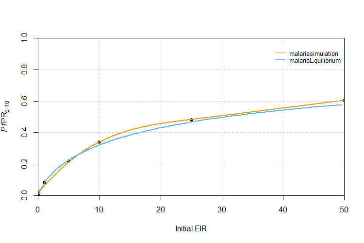
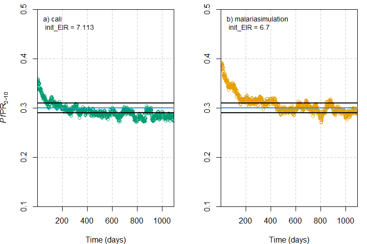

```{r, include = FALSE}
knitr::opts_chunk$set(
  collapse = TRUE,
  comment = "#>",
  dpi=300,
  fig.width=7
)
```

```{r setup, message=F, warning=F}
# Load the requisite packages:
library(malariasimulation)
library(malariaEquilibrium)
# Set colour palette:
cols <- c("#E69F00", "#56B4E9", "#009E73", "#CC79A7","#F0E442", "#0072B2", "#D55E00")

```

The entomological inoculation rate (EIR), defined as the number of infectious bites experienced per person per unit time, and malaria prevalence, the proportion of the population with detectable malaria, are two metrics used to measure and/or describe malaria transmission. With respect to the latter, the focus is often on the prevalence rate of *Plasmodium falciparum* in children aged two to ten years old, denoted *Pf*PR~2-10~.

When setting up a simulation, `malariasimulation` users often need to calibrate the model run to an observed level of transmission. Calibrating to an EIR value can be done directly using the `set_equilibrium()` function, but EIR is difficult to measure and in practice *Pf*PR~2-10~ is more commonly recorded/reported as a measure of transmission. However, `malariasimulation` does not allow users to calibrate directly to an *Pf*PR~2-10~ value. To calibrate to a target *Pf*PR~2-10~, users must instead identify and input the EIR value that yields the target *Pf*PR~2-10~ value. In this vignette, three methods for matching the EIR to a target *Pf*PR~2-10~ are outlined and compared.

The first and fastest method uses the `malariaEquilibrium` package function `human_equilibrium()` to calculate the equilibrium *Pf*PR~2-10~ for a given EIR using the canonical equilibrium solution for the `malariasimulation` model. The second method involves running `malariasimulation` simulations across a small set of initial EIR values, extracting the *Pf*PR~2-10~ from each simulation run, and fitting a model relating initial EIR to *Pf*PR~2-10~ to allow users to predict the initial EIR value required to yield the desired *Pf*PR~2-10~. The third approach is to calibrate the model using the `cali` package function (see https://github.com/mrc-ide/cali for more information) `calibrate()` , which searches a user-defined EIR parameter space and identifies the value which yields the target *Pf*PR~2-10~ to a defined tolerance.

## *Pf*PR~2-10~ matching using malariaEquilibrium

The `malariaEquilibrium` package function `human_equilibrium()` returns the canonical equilibrium solution for a given EIR and the *Pf*PR~2-10~ can be calculated from the output (see <https://github.com/mrc-ide/malariaEquilibrium> for more information). The first step is to set a large range of EIR values to generate matching *Pf*PR~2-10~ values for. Next, we load the package's default parameter set, specify an effective clinical treatment coverage (`ft`) of 0.45 and, for each EIR value generated, run the `human_equilibrium()` function.

The `human_equilibrium()` function returns a dataframe containing the proportion of each age class in each state variable at equilibrium. The *Pf*PR~2-10~ can be calculated from the output for each EIR value by summing the proportion of people aged 2-10 with cases of malaria (`pos_M`) and dividing this proportion by the proportion of the population between the ages 2-10 (`prop`). Finally, we store the matching EIR and *Pf*PR~2-10~ values in a data frame.

```{r}
# Establish a range of EIR values to generate matching PfPR2-10 values for:
malEq_EIR <- seq(from = 0.1, to = 50, by = 0.5)

# Load the base malariaSimulation parameter set:
q_simparams <- malariaEquilibrium::load_parameter_set("Jamie_parameters.rds")

# Use human_equilibrium() to calculate the PfPR2-10 values for the range of
# EIR values:
malEq_prev <- vapply(
  malEq_EIR,
  function(eir) {
    eq <- malariaEquilibrium::human_equilibrium(
      eir,
      ft = 0.45,
      p = q_simparams,
      age = 0:100
    )
    sum(eq$states[3:11, 'pos_M']) / sum(eq$states[3:11, 'prop'])
  },
  numeric(1)
)

# Establish a dataframe containing the matching EIR and PfPR2-10 values:
malEq_P2E <- cbind.data.frame(EIR = malEq_EIR, prev = malEq_prev)

# View the dataframe containing the EIR and matching PfPR2-10 values:
head(malEq_P2E, n = 7)
```

As this method does not involve running simulations it can return matching *Pf*PR~2-10~ for a wide range of EIR values very quickly. However, it is only viable for systems at steady state, with a fixed set of parameter values, and only enables the user to capture the effects of the clinical treatment of cases. Often when running `malariasimulation` simulations, one or both of these conditions are not met. In this example, we have set the proportion of cases effectively treated (`ft`) to 0.45 to capture the effect of clinical treatment with antimalarial drugs. However, the user may, for example, also wish to include the effects of a broader suite of interventions (e.g. bed nets, vaccines, etc.), or to capture changes in the proportion of people clinically treated over time. In these cases, a different solution would therefore be required.

## *Pf*PR~2-10~ matching using malariasimulation

Where the `malariaEquilibrium` method is not viable, an alternative is to run `malariasimulation` simulations over a smaller range of initial EIR values, extract the *Pf*PR~2-10~ from each run, fit a model relating initial EIR to *Pf*PR~2-10~, and use the model to predict the initial EIR value required to yield the desired *Pf*PR~2-10~. This approach allows users to benefit from the tremendous flexibility in human population, mosquito population, and intervention package parameters afforded by the `malariasimulation` package. An example of this method is outlined below.

### Establish malariasimulation parameters

To run `malariasimulation`, the first step is to generate a list of parameters using the `get_parameters()` function, which loads the default `malariasimulation` parameter list. Within this function call, we adapt the average age of the human population to flatten its demographic profile, instruct the model to output malaria prevalence in the age range of 2-10 years old, and switch off the individual-based mosquito module. The `set_species()` function is then called to specify a vector community composed of *An. gambiae*, *An. funestus*, and *An arabiensis* at a ratio of 2:1:1. The `set_drugs()` function is used to append the built-in parameters for artemether lumefantrine (AL) and, finally, the `set_clinical_treatment()` function is called to specify a treatment campaign that distributes AL to 45% of the population in the first time step (t = 1).

```{r}
# Specify the time frame over which to simulate and the human population size:
year <- 365
human_population <- 5000

# Use the get_parameters() function to establish a list of simulation parameters:
simparams <- get_parameters(list(
  
  # Set the population size:
  human_population = human_population,
  
  # Set the average age (days) of the population:
  average_age = 23 * year,   
  
  # Instruct model to render prevalence in age group 2-10:
  prevalence_rendering_min_ages = 2 * year,    
  prevalence_rendering_max_ages = 10 * year))

# Use the set_species() function to specify the mosquito population (species and 
# relative abundances):
simparams <- set_species(parameters = simparams, 
                         species = list(arab_params, fun_params, gamb_params), 
                         proportions = c(0.25, 0.25, 0.5))

# Use the set_drugs() function to append the in-built parameters for the 
# drug artemether lumefantrine (AL):
simparams <- set_drugs(simparams, list(AL_params))

# Use the set_clinical_treatment() function to parameterise human 
# population treatment with AL in the first timestep:
simparams <- set_clinical_treatment(parameters = simparams, 
                                    drug = 1,
                                    timesteps = c(1),
                                    coverages = c(0.45))
```

### Run the simulations and calculate *Pf*PR~2-10~

Having established a set of `malariasimulation` parameters, we are now ready to run simulations. In the following code chunk, we'll run the `run_simulation()` function across a range of initial EIR values to generate sufficient points to fit a curve matching *Pf*PR~2-10~ to the initial EIR. For each initial EIR, we first use the `set_equilibrium()` to update the model parameter list with the human and vector population parameter values required to achieve the specified EIR at equilibrium. This updated parameter list is then used to run the simulation.

The `run_simulation()` outputs an EIR per time step, per species, across the entire human population. We first convert these to get the number of infectious bites experienced, on average, by each individual across the final year across all vector species. Next, the average *Pf*PR~2-10~ across the final year of the simulation is calculated by dividing the total number of individuals aged 2-10 by the number (`n_age_730_3650`) of detectable cases of malaria in individuals aged 2-10 (`n_detect_730_3650`) on each day and calculating the mean of these values. Finally, initial EIR, output EIR, and *Pf*PR~2-10~ are stored in a data frame.

```{r}
# Establish a vector of initial EIR values to simulate over and generate matching
# PfPR2-10 values for:
init_EIR <- c(0.01, 0.1, 1, 5, 10, 25, 50)

# For each initial EIR, calculate equilibrium parameter set and run the simulation:
malSim_outs <- lapply(
  init_EIR,
  function(init) {
    p_i <- set_equilibrium(simparams, init)
    run_simulation(5 * year, p_i)
  }
)

# Convert the default EIR output (per vector species, per timestep, across 
# the entire human population) to a cross-vector species average EIR per
# person per year across the final year of the simulation:
malSim_EIR <- lapply(
  malSim_outs,
  function(output) {
    mean(
      rowSums(
        output[
          output$timestep %in% seq(4 * 365, 5 * 365),
          grepl('EIR_', names(output))
        ] / human_population * year
      )
    )
  }
)

# Calculate the average PfPR2-10 value across the final year for each initial
# EIR value:
malSim_prev <- lapply(
  malSim_outs,
  function(output) {
    mean(
      output[
        output$timestep %in% seq(4 * 365, 5 * 365),
        'n_detect_730_3650'
      ] / output[
        output$timestep %in% seq(4 * 365, 5 * 365),
        'n_age_730_3650'
      ]
    )
  }
)
 
# Create dataframe of initial EIR, output EIR, and PfPR2-10 results:
malSim_P2E <- cbind.data.frame(init_EIR, EIR = unlist(malSim_EIR), prev = unlist(malSim_prev))

# View the dataframe containing the EIR and matching PfPR2-10 values:
malSim_P2E
```

### Fit line of best fit relating initial EIR values to *Pf*PR~2-10~

Having run `malariasimulation` simulations for a range of initial EIRs, we can fit a line of best fit through the initial EIR and *Pf*PR~2-10~ data using the `gam()` function (`mgcv`) and then use the `predict()` function to return the *Pf*PR~2-10~ for a wider range of initial EIRs (given the set of parameters used).

```{r, eval = F}
library(mgcv)

# Fit a line of best fit through malariasimulation initial EIR and PfPR2-10
# and use it to predict a series of PfPR2-10 values for initial EIRs ranging
# from 0.1 to 50:
malSim_fit <- predict(gam(prev~s(init_EIR, k = 5), data = malSim_P2E), 
                      newdata = data.frame(init_EIR = c(0, seq(0.1, 50, 0.1))),
                      type = "response")

# Create a dataframe of initial EIR values and PfPR2-10 values:
malSim_fit <- cbind(malSim_fit, data.frame(init_EIR = c(0 ,seq(0.1, 50, 0.1))))
```

## Visualisation

Let's visually compare the `malariaEquilibrium` and `malariasimulation` methods for matching EIR to *Pf*PR~2-10~ values. In the section below we open a blank plot, plot the initial EIR and resulting *Pf*PR~2-10~ points generated using `malariasimulation` runs and overlay the line of best fit (orange line). Also overlayed is a line mapping EIR and *Pf*PR~2-10~ values calculated using `malariaEquilibrium` (blue line).

```{r,  eval = F}
# Establish a plotting window:
plot(x = 1, type = "n", 
     xlab = "Initial EIR", ylab = expression(paste(italic(Pf),"PR"[2-10])),
     xlim = c(0,50), ylim = c(0, 1),
     xaxs = "i", yaxs = "i");grid(lty = 2, col = "grey80", lwd = 0.5)

# Overlay the initial EIR and corresponding PfPR2-10 points from malariasimulation:
points(x = malSim_P2E$init_EIR, 
       y = malSim_P2E$prev,
       pch = 19,
       col = 'black')

# Overlay the malariasimulation line of best fit:
lines(x = malSim_fit$init_EIR, 
      y = malSim_fit$malSim_fit, 
      col = cols[1],
      lwd = 2,
      type = "l", 
      lty = 1)

# Overlay the malariaEquilibrium EIR to PfPR2-10 line:
lines(x = malEq_P2E$EIR, 
      y = malEq_P2E$prev, 
      col = cols[2], 
      type = "l",
      lwd = 2,
      lty = 1)

# Add a legend:
legend("topright",
       legend = c("malariasimulation", "malariaEquilibrium"),
       col = c(cols[1:2]),
       lty = c(1,1),
       box.col = "white",
       cex = 0.8)
```



We can see that the `malariaEquilibrium` provides a reasonable approximation when the target *Pf*PR~2-10~ is low, but recommends slightly different initial EIR values for intermediate *Pf*PR~2-10~ values. However, in our example we only simulated clinical treatment covering 45% of the population. If we needed to identify the EIR to yield a target *Pf*PR~2-10~ value in a scenario in which additional interventions, such as bed nets or vaccines, had been deployed, the difference between the EIR value recommended by these methods would be likely to increase significantly.

## Matching EIR to *Pf*PR~2-10~ values

Using the fitted relationship between initial EIR and *Pf*PR~2-10~, we can create a function that returns the EIR value(s) estimated to yield a target *Pf*PR~2-10~ given the model parameters. The function works by finding the closest *Pf*PR~2-10~ value from the values generated when we fit the model to a target value input by the user, and then using that index to return the corresponding initial EIR value.

```{r, eval = F}
# Store some target PfPR2-10 values to match to:
PfPRs_to_match <- c(0.10, 0.25, 0.35, 0.45)

# Create a function to match these baseline PfPR2-10 values to EIR values
# using the model fit:
match_EIR_to_PfPR <- function(x){
  
  m <- which.min(abs(malSim_fit$malSim_fit-x))
  malSim_fit[m,2]
  
}

# Use the function to extract the EIR values for the specified 
# PfPR2-10 values:
matched_EIRs <- unlist(lapply(PfPRs_to_match, match_EIR_to_PfPR))

# Create a dataframe of matched PfPR2-10 and EIR values:
cbind.data.frame(PfPR = PfPRs_to_match, Matched_EIR = matched_EIRs)
```

## Calibrating *Pf*PR~2-10~ using the cali package

The third option is to use the `calibrate()` function from the `cali` package (for details see: https://github.com/mrc-ide/cali) to return the EIR required to yield a target *Pf*PR~2-10~. Rather than manually running a series of simulations with varied, user-defined EIRs, this package contains the `calibrate()` function, which calibrates `malariasimulation` simulation outputs to a target *Pf*PR~2-10~ value within a user-specified tolerance by trying a series of EIR values within a defined range.

The `calibrate()` function accepts as inputs a list of `malariasimulation` parameters, a summary function that takes the `malariasimulation` output and returns a vector of the target variable (e.g. a function that returns the *Pf*PR~2-10~), and a tolerance within which to accept the output target variable value and terminate the routine. To reduce the time taken by the `calibrate()` function, the user can also specify upper and lower bounds for the EIR space the function will search. The function runs through a series of `malariasimulation` simulations, trying different EIRs and honing in on the target value of the target variable, terminating when the target value output falls within the tolerance specified.

```{r, eval = F}
library(cali)

# Prepare a summary function that returns the mean PfPR2-10 from each simulation output: 
summary_mean_pfpr_2_10 <- function (x) {
 
 # Calculate the PfPR2-10:
 prev_2_10 <- mean(x$n_detect_730_3650/x$n_age_730_3650)
 
 # Return the calculated PfPR2-10:
 return(prev_2_10)
}

# Establish a target PfPR2-10 value:
target_pfpr <- 0.3

# Add a parameter to the parameter list specifying the number of timesteps to
# simulate over. Note, increasing the number of steps gives the simulation longer
# to stablise/equilibrate, but will increase the runtime for calibrate().  
simparams$timesteps <- 3 * 365

# Establish a tolerance value:
pfpr_tolerance <- 0.01

# Set upper and lower EIR bounds for the calibrate function to check (remembering EIR is
# the variable that is used to tune to the target PfPR):
lower_EIR <- 5; upper_EIR <- 8

# Run the calibrate() function:
cali_EIR <- calibrate(target = target_pfpr,
                      summary_function = summary_mean_pfpr_2_10,
                      parameters = simparams,
                      tolerance = pfpr_tolerance, 
                      low = lower_EIR, high = upper_EIR)

# Use the match_EIR_to_PfPR() function to return the EIR predicted to be required under the
# malariasimulation method:
malsim_EIR <- match_EIR_to_PfPR(x = target_pfpr)
```

The `calibrate()` function is a useful tool, but be aware that it relies on the user selecting and accurately coding an effective summary function, providing reasonable bounds on the EIR space to explore, and selecting a population size sufficiently large to limit the influence of stochasticity.

As a final exercise, let's compare graphically the `calibrate()` approach with the `malariasimulation` method when the same parameter set is used. The plot below shows the change in *Pf*PR~2-10~ over the duration of the simulation under the initial EIR values recommended by the a) `cali` and b) `malariasimulation` methods to achieve the target *Pf*PR~2-10~ value of 0.3. The blue horizontal line represents the target *Pf*PR~2-10~ and the black lines either side are the upper and lower tolerance limits specified for the `cali` method.

```{r,  eval = F}
# Use the set_equilibrium() function to calibrate the simulation parameters to the EIR:
simparams_cali <- set_equilibrium(simparams, init_EIR = cali_EIR)
simparams_malsim  <- set_equilibrium(simparams, init_EIR = malsim_EIR)

# Run the simulation:
cali_sim <- run_simulation(timesteps = (simparams_cali$timesteps),
                           parameters = simparams_cali)
malsim_sim <- run_simulation(timesteps = (simparams_malsim$timesteps),
                             parameters = simparams_malsim)

# Extract the PfPR2-10 values for the cali and malsim simulation outputs:
cali_pfpr2_10 <- cali_sim$n_detect_730_3650 / cali_sim$n_age_730_3650
malsim_pfpr2_10 <- malsim_sim$n_detect_730_3650 / malsim_sim$n_age_730_3650

# Store the PfPR2-10 in each time step for the two methods:
df <- data.frame(timestep = seq(1, length(cali_pfpr2_10)),
                 cali_pfpr = cali_pfpr2_10,
                 malsim_pfpr = malsim_pfpr2_10)

# Set the plotting window:
par(mfrow = c(1, 2), mar = c(4, 4, 1, 1))

# Plot the PfPR2-10 under the EIR recommended by the cali method:
plot(x = df$timestep,
     y = df$malsim_pfpr,
     type = "b",
     ylab = expression(paste(italic(Pf),"PR"[2-10])),
     xlab = "Time (days)",
     ylim = c(target_pfpr - 0.2, target_pfpr + 0.2),
     #ylim = c(0, 1),
     col = cols[3])

# Add grid lines
grid(lty = 2, col = "grey80", lwd = 0.5)

# Add a textual identifier and lines indicating target PfPR2-10 with
# tolerance bounds:
text(x = 10, y = 0.47, pos = 4, cex = 0.9,
     paste0("a) cali \n init_EIR = ", round(cali_EIR, digits = 3)))
abline(h = target_pfpr, col = "dodgerblue", lwd = 2)
abline(h = target_pfpr - pfpr_tolerance, lwd = 2)
abline(h = target_pfpr + pfpr_tolerance, lwd = 2)

# Plot the PfPR2-10 under the EIR recommended by the malariasimulation method:
plot(x = df$timestep,
     y = df$cali_pfpr,
     type = "b",
     xlab = "Time (days)",
     ylab = "",
     ylim = c(target_pfpr - 0.2, target_pfpr + 0.2),
     #ylim = c(0, 1),
     col = cols[1])

# Add grid lines
grid(lty = 2, col = "grey80", lwd = 0.5)

# Add a textual identifier and lines indicating target PfPR2-10 with
# tolerance bounds
text(x = 10, y = 0.47, pos = 4, cex = 0.9,
     paste0("b) malariasimulation \n init_EIR = ", round(malsim_EIR, digits = 3)))
abline(h = target_pfpr, col = "dodgerblue", lwd = 2)
abline(h = target_pfpr - pfpr_tolerance, lwd = 2)
abline(h = target_pfpr + pfpr_tolerance, lwd = 2)
```


