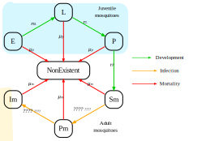

```{r, include = FALSE}
knitr::opts_chunk$set(
  collapse = TRUE,
  comment = "#>",
  dev="svglite"
)
```

This is an individual based model for P. Falciparum and malaria interventions.

## Human Biology

The human variables are documented in [R/variables.R](https://github.com/mrc-ide/malariasimulation/blob/master/R/variables.R).

The human biological processes are spread out between the following files:

 1. [R/human_infection.R](https://github.com/mrc-ide/malariasimulation/blob/master/R/human_infection.R)
 2. [R/disease_progression.R](https://github.com/mrc-ide/malariasimulation/blob/master/R/disease_progression.R)
 3. [R/mortality_processes.R](https://github.com/mrc-ide/malariasimulation/blob/master/R/mortality_processes.R)


### States
Modelled human states are Susceptible (*S*), Treated (*Tr*), Clinical disease (*D*), Asymptomatic infection (*A*) and Sub-patent infection (*U*).

### Parameters
Parameters shown on the infographic include: the force of infection ($\Lambda_i$), the probability of clinical disease ($\phi_i$), the probability of receiving treatment ($f_T$), and rates of recovery from clinical disease to asymptomatic infection ($r_D$), asymptomatic infection to sub-patent infection ($r_A$), sub-patent infection and treated disease to complete recovery ($r_T$ and $r_U$). Superinfection may occur in individuals with asymptomatic or sub-patent infections at the same rates as standard infection (dashed arrows).

Details that determine the force of infection can be found ***elsewhere: give links to resources***. All default parameters can be found using [get_parameters()](https://mrc-ide.github.io/malariasimulation/reference/get_parameters.html) where the rate parameters shown here represent delays are input into the model by first converting to duration in days, e.g. for the input `dr`, $dr = \frac{1}{r_D}$.

To maintain a constant population size during simulations, the birth rate of new susceptible individuals is set to be equal to the overall death rate.

***Could give explicit equations***

***Could give defaults for parameters specified***

***Could explain how lambda is given***

## Mosquito Biology

The mosquito biological processes are spread out between the following files:

 1. [src/mosquito_ode.cpp]() ***Can't find a file with this name***
 2. [src/mosquito_emergence.cpp]() ***Can't find a file with this name***''
 3. [R/mosquito_biology.R](https://github.com/mrc-ide/malariasimulation/blob/master/R/mosquito_biology.R)



### States
Modelled mosquito states are separated into early (*E*) and late (*L*) larval stages, the pupal stage (*P*) and three adult states for susceptible (*Sm*), incubating (*Pm*) and infectious individuals (*Im*).

### Parameters
Parameters shown on the infographic include: mosquito developmental rates from early to late larval stages ($r_{EL}$), to the pupal stage ($r_{L}$) and to adult stage ($r_P$). Susceptible adults (*Sm*) may become infected (***These rates are not clear to me and it would be good to add these to the model infographic and to this text***) with a latent period (*Pm*) before becoming infectious (*Im*). Larval and pupal stages die at a rate of $\mu_p$ while adults die at a density dependent rate of $\mu_m$, where they then enter the *NonExistent* state. ***I need to read up on this density dependence.***

***Density dependence of mosquito deaths***

***Could show how these models are connected together in a bit more detail***

\

# Basic simulation

### Simulation code
The key package function is `run_simulation()` which, in its most basic form, simply requires a number of timesteps in days. Default parameter settings assume a population of size of 100 with no treatment interventions ***what are other default settings?***, and which can be seen in full using [get_parameters()](https://mrc-ide.github.io/malariasimulation/reference/get_parameters.html).

```{r, output.lines=6}
library(malariasimulation)
Test_Sim <- run_simulation(timesteps = 100)
```


### Output
The model then simulates a malaria epidemic and returns key outputs such as:

- `infectivity`: human infectiousness
- `EIR_All`: the entomological inoculation rate
- `FOIM`: the force of mosquito infection
- `mu_All`: adult mosquito death rate ***Why is this important? isn't this just mu_m? I suppose it's density dependent. Look into this in more detail***
- `n_bitten`: the number of infectious bites
- `n_infections`: the number human infections
- `natural_deaths`: deaths from old age
- `S_count`, `A_count`, `D_count`, `U_count`, `Tr_count`: the human population size in each state
- `ica_mean`: mean acquired immunity to clinical infection
- `icm_mean`: mean maternal immunity to clinical infection
- `ib_mean`: mean blood immunity to all infection
- `id_mean`: mean immunity from detected using microscopy
- `iva_mean`: mean acquired immunity to severe infection
- `ivm_mean`: mean maternal immunity to severe infection
- `n_730_3650`: population size of an age group of interest (where the default is set to 730-3650 days old, or 2-10 years, but which may be adjusted (see [Demography](https://mrc-ide.github.io/malariasimulation/articles/Demography.html) vignette for more details)
- `n_detect_730_3650`: number with possible detection through microscopy of a given age group
- `p_detect_730_3650`: the sum of probabilities of detection through microscopy of a given age group
- `E_All_count`, `L_All_count`, `P_All_count`, `Sm_All_count`, `Pm_All_count`, `Im_All_count`, `NonExistent_All_count`: mosquito population sizes in each state
- `mosquito_deaths`: mosquito deaths


```{r, output.lines=6}
head(Test_Sim, n = 3)
```

### Additional outputs
**Age stratified** results for **incidence**, **clinical incidence** and **severe case incidence** may also be included in the output if desired and must be specified in the parameter list (see [get_parameters()](https://mrc-ide.github.io/malariasimulation/reference/get_parameters.html) for more details and [Demography](https://mrc-ide.github.io/malariasimulation/articles/Demography.html) for an example). These inputs will add extra columns to the output for the number of infections (**`n_`**) and the sum of probabilities of infection (**`p_`**) for the relevant total, clinical or severe incidences for each specified age group.

Where **treatments** are specified, `n_treated` will report the number that have received treatment. Where **bed nets** are distributed, `net_usage` specifies the number sleeping under a bednet.

***`rate_D_A`, `rate_A_U`, `rate_U_S`*** These are found in the help page for `run_simulation()` How are these output???


### Output visualisation
These outputs can then be visualised, such as the population changes in states. Another key output is the prevalence of detectable infections between the ages of 2-10 (*Pf*PR~2-10~), which can be obtained by dividing `n_detect_730_3650` by `n_730_3650`.

```{r, out.width = "45%", echo = FALSE}
cols_to_plot <- paste0(c("S","A","D","U","Tr"),"_count")
Rich_cols  <- c("#E69F00", "#56B4E9", "#009E73", "#F0E442", "#0072B2", "#D55E00", "#CC79A7")
states_plot <- function(){
  plot(x = Test_Sim$timestep, y = Test_Sim[,cols_to_plot[1]], type = "l", col = Rich_cols[1], ylim = c(0,80), ylab = "Population size", xlab = "Days")
  sapply(2:5, function(x){points(x = Test_Sim$timestep, y = Test_Sim[,cols_to_plot[x]], type = "l", col = Rich_cols[x])})
  legend("topleft", legend = c("S","A","D","U","Tr"), col = Rich_cols, lty = 1, bty = "n", ncol = 5)
}

states_plot()
plot(x = Test_Sim$timestep, y = Test_Sim$n_detect_730_3650/Test_Sim$n_730_3650, type = "l", col = Rich_cols[7], ylim = c(0,1), ylab = expression(paste(italic(Pf),"PR"[2-10])), xlab = "Days")
```


\

# Changing parameters

## Vignettes

The remaining vignettes describe how to adjust sets of parameters through a number of functions as follows:

1. [Population demography](https://mrc-ide.github.io/malariasimulation/articles/Demography.html) 

    - rendering age groups
    - `set_demography()`: setting demographies
    - `set_equilibrium()`: establishing initial human and mosquito populations to achieve initial equilibrium conditions
    - ***Possibly include `find_birthrates`.***

\

2. Mosquito related functions

    - Modelling mosquito seasonality,
    - IBM or ODE modelling of mosquitoes,
    - `set_species()`: for species specific parameters (with in-built parameter sets)
    - ***Possibly include *** - parameterise_mosquito_equilibrium???
    - parameterise_total_M???

\

3. [Treatment](https://mrc-ide.github.io/malariasimulation/articles/Treatment.html)

    - `set_drugs()`: for drug-specific parameters (with in-built parameter sets)
    - `set_clinical_treatment()`: implemention of clinical treatment interventions

\

4. [MDA and chemoprevention](https://mrc-ide.github.io/malariasimulation/articles/MDA.html)

    - `set_mda()`: implemention of mass drug administration interventions
    - `set_smc()`: implementation of seasonal malarial chemoprevention interventions
    - `set_pmc()`: implementation of perrenial malarial chemoprevention interventions
    - `peak_season_offset()`: correlating timed intervetions with seasonal malaria

\

5. [Vaccines](https://mrc-ide.github.io/malariasimulation/articles/Vaccines.html)

    - `set_mass_rtss()`: implementation of a rtss vaccination intervention
    - `set_tbv()`: implementation of a tbv vaccination intervention

\

6. [Vector Control](https://mrc-ide.github.io/malariasimulation/articles/VectorControl.html)

    - `set_bednets()`: implementation of bednet distribution intervention
    - `set_spraying()`: implementation of an indoor residual spraying intervention

\

7. [Matching PfPR2-10 to EIR](https://mrc-ide.github.io/malariasimulation/articles/EIRprevmatch.html)

    - ***Need to work out what this is doing and why***
    - malariaEquilibrium::human equilibrium (Is there anything else from this package that would be useful to describe?). Also, links to package information???
    - set an equilibrium <based on...??> (set_equilibrium)

\

8. [Metapopulation modelling](https://mrc-ide.github.io/malariasimulation/articles/Metapopulation.html)

    - `run_metapop_simulation()`: to model multiple areas simulateously

\

9. [Variation](https://mrc-ide.github.io/malariasimulation/articles/Variation.html)

    - `run_simulation_with_repetitions()`: running simulations with replicates

\

## Changing other parameters

It is not recommended that parameters are adjusted without using these functions without close and detailed attention, but if this is necessary, any parameter may be changed using the `overrides` argument in the `get_parameters()` function. The `get_parameters()` function generates a complete parameter set that may be fed into `run_simulation()`. New parameters must be in the same class as the parameters they replace (e.g. if the parameter is a numeric, its replacement must also be numeric, if logical, the replacement must also be logical) and inputs must be given as a list. An example is given below.

This simple example shows how to change the human population size. The parameter name for human population size is `human_population`.
```{r}
# Use get_parameters(overrides = list(...))) to set new parameters
new_params <- get_parameters(overrides = list(human_population = 200)) 
```


###
***Which parameters don't get addressed in the vignettes? What do these parameters do?***
Correlation_Parameters
find_birthrates()
get_correlation_parameters()
parameterise_mosquito_equilibrium()
parameterise_total_M()