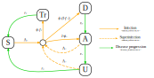

```{r, include = FALSE}
knitr::opts_chunk$set(
  collapse = TRUE,
  comment = "#>",
  dpi=300,
  fig.width=7
)
```

```{r, output.lines=6}
# Load the requisite packages:
library(malariasimulation)
# Set colour palette:
cols  <- c("#E69F00", "#56B4E9", "#009E73", "#F0E442", "#0072B2", "#D55E00", "#CC79A7")
```

This vignette gives a high-level overview of the individual-based malariasimulation model. It then gives a basic example of how the model can be used, how to initiate the model with equilibrium conditions, and demonstrates how to change named parameter inputs, including setting seasonality parameters. Finally, it lists and broadly describes the content of the remaining vignettes, summarising parameter and intervention setting functions.

## Model structure

### Human Biology

The human variables are documented in [R/variables.R](https://github.com/mrc-ide/malariasimulation/blob/master/R/variables.R).

The functions governing the human flow of infection and immunity processes are described in the following files:

1.  [R/human_infection.R](https://github.com/mrc-ide/malariasimulation/blob/master/R/human_infection.R)
2.  [R/disease_progression.R](https://github.com/mrc-ide/malariasimulation/blob/master/R/disease_progression.R)
3.  [R/mortality_processes.R](https://github.com/mrc-ide/malariasimulation/blob/master/R/mortality_processes.R)



#### States

Modelled human states are Susceptible (*S*), Treated (*Tr*), Clinical disease (*D*), Asymptomatic infection (*A*) and Sub-patent infection (*U*).

#### Parameters

Parameters shown on the infographic include:

-   $\Lambda_i$: the age-specific (*i*) force of infection
-   $\phi_i$: the age-specific (*i*) probability of clinical disease
-   $f_T$: the probability of receiving treatment (or force of treatment)

with the rates of recovery:

-   $r_D$: from clinical disease to asymptomatic infection
-   $r_A$: from asymptomatic infection to sub-patent infection
-   $r_U$: from sub-patent infection to complete recovery
-   $r_T$: from treated clinical disease to complete recovery

Superinfection may occur in individuals with asymptomatic or sub-patent infections at the same rates as standard infection (dashed arrows).

The force of infection ($\Lambda_i$) is impacted by pre-erythrocytic immunity, mosquito biting rate and population size and level of infectivity (specific details can be found in the references below). All default parameters can be found in the documentation for the function `get_parameters()`. Please also note that while the infographic above displays rate parameters, the parameter list uses delay durations, e.g. the rate $r_D$ is the inverse of the delay from state *D* to *A* (`dr` in the model):

$$r_D=dr^{-1}$$

To maintain a constant population size during simulations, the birth rate of new susceptible individuals is set to be equal to the overall death rate.

### Mosquito Biology

The functions governing mosquito biological processes and dynamics are spread out between the following files:

1.  [R/mosquito_biology.R](https://github.com/mrc-ide/malariasimulation/blob/master/R/mosquito_biology.R)
2.  [R/biting_process.R](https://github.com/mrc-ide/malariasimulation/blob/master/R/biting_process.R)
3.  [R/compartmental.R](https://github.com/mrc-ide/malariasimulation/blob/master/R/compartmental.R)


#### States

Modelled mosquito states are separated into three juvenile stages: early (*E*) and late (*L*) larval stages, the pupal stage (*P*), and three adult states: susceptible (*S*<sub>M</sub>), incubating (*P*<sub>M</sub>) and infectious individuals (*I*<sub>M</sub>). Mosquitoes in any state may die, where they enter the NonExistent state. The model tracks both male and female juvenile mosquitoes, but only female adult mosquitoes.

#### Parameters

Parameters shown on the infographic include mosquito developmental rates:

-   $r_{EL}$: from early to late larval stage

-   $r_{L}$: from late larval stage to pupal stage

-   $r_P$: from pupal stage to adult stage

Mosquito infection and incubation rates:

-   $\Lambda_M$: the force of infection on mosquitos (FOIM, i.e. from human to mosquito)

-   $r_{EM}$: extrinsic incubation period

And mortality rates:

-   $\mu_E(t)$: the early larval stage death rate

-   $\mu_L(t)$: the late larval stage death rate

-   $\mu_P$: the pupal death rate

-   $\mu_M$: the adult mosquito death rate

Larval mosquitoes experience density dependent mortality due to a carrying capacity, $K(t)$, which may change seasonally with rainfall and where $\gamma$ is the effect of density-dependence on late stage larvae compared with early stage larvae as follows:

$$
\mu_E = \mu_E^0(1+\frac{E(t)+L(t)}{K(t)}) \\
\mu_L = \mu_L^0(1+\gamma\frac{E(t)+L(t)}{K(t)})
$$

### Key Model References (structure and dynamics)

Griffin JT, Hollingsworth TD, Okell LC, Churcher TS, White M, et al. (2010) Reducing *Plasmodium falciparum* Malaria Transmission in Africa: A Model-Based Evaluation of Intervention Strategies. PLOS Medicine 7(8): e1000324. <https://doi.org/10.1371/journal.pmed.1000324>

White, M.T., Griffin, J.T., Churcher, T.S. *et al.* Modelling the impact of vector control interventions on *Anopheles gambiae* population dynamics. *Parasites Vectors* **4**, 153 (2011). <https://doi.org/10.1186/1756-3305-4-153>

Griffin, J., Ferguson, N. & Ghani, A. Estimates of the changing age-burden of *Plasmodium falciparum* malaria disease in sub-Saharan Africa. *Nat Commun* **5**, 3136 (2014). <https://doi.org/10.1038/ncomms4136>

Griffin, J. T., Déirdre Hollingsworth, T., Reyburn, H., Drakeley, C. J., Riley, E. M., & Ghani, A. C. (2015). Gradual acquisition of immunity to severe malaria with increasing exposure. Proceedings of the Royal Society B: Biological Sciences, 282(1801). <https://doi.org/10.1098/rspb.2014.2657>

Griffin, J. T., Bhatt, S., Sinka, M. E., Gething, P. W., Lynch, M., Patouillard, E., Shutes, E., Newman, R. D., Alonso, P., Cibulskis, R. E., & Ghani, A. C. (2016). Potential for reduction of burden and local elimination of malaria by reducing Plasmodium falciparum malaria transmission: A mathematical modelling study. The Lancet Infectious Diseases, 16(4), 465--472. [https://doi.org/10.1016/S1473-3099(15)00423-5](https://doi.org/10.1016/S1473-3099(15)00423-5)

## Run simulation

### Code

The key package function is `run_simulation()` which simply requires, in its most basic form, a number of timesteps in days. Default parameter settings assume a human population size of 100, an initial mosquito population size of 1000 (where the default species is set to *Anopheles gambiae*), with no treatment interventions and no seasonality and models the spread of *Plasmodium falciparum*. The full parameters list can be seen in the documentation for `get_parameters()`.

```{r, output.lines=6}
test_sim <- run_simulation(timesteps = 100)
```

### Output

The `run_simulation()` function then simulates malaria transmission dynamics and returns a dataframe containing the following outputs through time:

-   `infectivity`: human infectiousness
-   `EIR_All`: the entomological inoculation rate (for all mosquito species)
-   `FOIM`: the force of infection on mosquitoes
-   `mu_All`: adult mosquito death rate (for all species)
-   `n_bitten`: the number of infectious bites
-   `n_infections`: the number human infections
-   `natural_deaths`: deaths from old age
-   `S_count`, `A_count`, `D_count`, `U_count`, `Tr_count`: the human population size in each state
-   `ica_mean`: mean acquired immunity to clinical infection
-   `icm_mean`: mean maternal immunity to clinical infection
-   `ib_mean`: mean blood immunity to all infection
-   `id_mean`: mean immunity from detected using microscopy
-   `iva_mean`: mean acquired immunity to severe infection
-   `ivm_mean`: mean maternal immunity to severe infection
-   `n_730_3650`: population size of an age group of interest (where the default is set to 730-3650 days old, or 2-10 years, but which may be adjusted (see [Demography](https://mrc-ide.github.io/malariasimulation/articles/Demography.html) vignette for more details)
-   `n_detect_lm_730_3650`: number with possible detection through microscopy of a given age group
-   `p_detect_lm_730_3650`: the sum of probabilities of detection through microscopy of a given age group
-   `E_gamb_count`, `L_gamb_count`, `P_gamb_count`, `Sm_gamb_count`, `Pm_gamb_count`, `Im_gamb_count`: species-specific mosquito population sizes in each state (default set to *An. gambiae*)
-   `total_M_gamb`: species-specific number of adult mosquitoes (default set to *An. gambiae*)

```{r, output.lines=6}
head(test_sim, n = 3)
```

Additional output details can be found in the `run_simulation()` documentation.

### Additional outputs

**Age stratified** results for **incidence**, **clinical incidence** and **severe case incidence** may also be included in the output if desired and must be specified in the parameter list (see `get_parameters()` for more details and [Demography](https://mrc-ide.github.io/malariasimulation/articles/Demography.html) for an example). These inputs will add extra columns to the output for the number of infections (**`n_`**) and the sum of probabilities of infection (**`p_`**) for the relevant total, clinical or severe incidences for each specified age group.

Where **treatments** are specified, `n_treated` will report the number that have received treatment. Where **bed nets** are distributed, `net_usage` specifies the number sleeping under a bednet.

### Output visualisation

These outputs can then be visualised, such as the population changes in states. Another key output is the prevalence of detectable infections between the ages of 2-10 (*Pf*PR~2-10~), which can be obtained by dividing `n_detect_lm_730_3650` by `n_730_3650`.

```{r, fig.align = 'center', out.width='100%', fig.asp=0.55, }
# Define vector of column names to plot
cols_to_plot <- paste0(c("S","D","A","U","Tr"),"_count")

# Create plotting function
states_plot <- function(sim){
  
  # Set up plot with first state
  plot(x = sim$timestep, y = sim[,cols_to_plot[1]],
       type = "l", col = cols[1], ylim = c(0,80),
       ylab = "Population size", xlab = "Days",
       xaxs = "i", yaxs = "i", lwd = 2)
  
  # Add remaining states
  sapply(2:5, function(x){
    points(x = sim$timestep, y = sim[,cols_to_plot[x]],
           type = "l", lwd = 2, col = cols[x])})
  grid(lty = 2, col = "grey80", lwd = 0.5)
  # Add legend
  legend("topleft", legend = c("S","D","A","U","Tr"), col = cols,
         lty = 1, lwd = 2, bty = "n", ncol = 3,  cex = 0.7)
}

par(mfrow = c(1,2))
states_plot(test_sim)

# Calculate Pf PR 2-10
test_sim$PfPR2_10 <- test_sim$n_detect_lm_730_3650/test_sim$n_730_3650

# Plot Pf PR 2-10
plot(x = test_sim$timestep, y = test_sim$PfPR2_10, type = "l",
     col = cols[7], ylim = c(0,1), lwd = 2,
     ylab = expression(paste(italic(Pf),"PR"[2-10])), xlab = "Days",
     xaxs = "i", yaxs = "i")
grid(lty = 2, col = "grey80", lwd = 0.5)
```

## Set equilibrium

Note that the model will not begin simulations from an equilibrium state as default (as in the simulation above). To begin the simulation at approximate equilibrium conditions, please use the `set_equilibrium()` function, which requires you to specify an initial EIR value:

```{r, fig.align = 'center', out.width='100%', fig.asp=0.55}
params <- get_parameters() |> 
  set_equilibrium(init_EIR = 5)

test_sim_eq <- run_simulation(timesteps = 100, parameters = params)

par(mfrow = c(1,2))
states_plot(test_sim_eq)

# Calculate Pf PR 2-10
test_sim_eq$PfPR2_10 <- test_sim_eq$n_detect_lm_730_3650/test_sim_eq$n_730_3650

# Plot Pf PR 2-10
plot(x = test_sim_eq$timestep, y = test_sim_eq$PfPR2_10, type = "l",
     col = cols[7], ylim = c(0,1),
     ylab = expression(paste(italic(Pf),"PR"[2-10])), xlab = "Days",
     xaxs = "i", yaxs = "i", lwd = 2)
grid(lty = 2, col = "grey80", lwd = 0.5)

```

## Override parameters

The `get_parameters()` function generates a complete parameter set that may be fed into `run_simulation()`. A number of **helper functions** have been designed to assist in changing and setting key parameters, which are explained across the remaining vignettes.

Some parameters (e.g. population size, age group rendering, setting seasonality) must still be replaced directly. When this is the case, care must be taken to ensure the replacement parameters are in the same class as the default parameters (e.g. if the parameter is a numeric, its replacement must also be numeric, if logical, the replacement must also be logical). Parameters are replaced by passing a list of named parameters to the `get_parameters()` function using the `overrides` argument. The following example shows how to change the `human_population` parameter.

```{r}
# Use get_parameters(overrides = list(...))) to set new parameters
new_params <- get_parameters(overrides = list(human_population = 200)) 
```

While other parameters can be changed individually, we do not generally recommended adjusting these without a detailed understanding of how this will impact the model assumptions. We strongly encourage users to stick with the parameter setting functions and methods described in these vignettes when adjusting parameter settings.

## Seasonality

The `malariasimulation` package has the capacity to simulate malaria transmission for a range of seasonal transmission profiles. This is achieved by specifying an annual rainfall profile that shapes mosquito population dynamics, thereby impacting malaria transmission. Please see the [Umbrella](https://github.com/mrc-ide/umbrella) package for instructions on generating seasonality parameters.

To include seasonality, we must set the parameter `model_seasonality = TRUE` and assign values to parameters that determine seasonality: `g0`, `g` and `h` (which represent fourier coefficients). These parameters must be set directly by passing a list of named parameters to the `overrides` argument of the `get_parameters()` function.

```{r, fig.align = 'center', out.width='100%'}
# Set parameters, including seasonality parameters
params_seasons <- get_parameters(overrides = list(
  model_seasonality = TRUE,
  g0 = 0.28,
  g = c(0.2, -0.07, -0.001),
  h = c(0.2, -0.07, -0.1)))

# Run simulation
seasonality_simulation <- run_simulation(timesteps = 600, parameters = params_seasons)

# Collect results
All_mos_cols <- paste0(c("E","L","P","Sm","Pm", "Im"),"_gamb_count")

# Plot results
plot(seasonality_simulation[,1], rowSums(seasonality_simulation[,All_mos_cols]), lwd = 2,
     ylim = c(0, 120000), type = "l", xlab = "Days", ylab = "Mosquito population size")
grid()
```

The mosquito population size is no longer constant and follows the patterns set by rainfall.

## Individual mosquitoes

Mosquitoes may also be modelled deterministically (the default) or individually.

To model individual mosquitoes, set `individual_mosquitoes` to `TRUE` in the `overrides` argument of `get_parameters()`.

```{r}
simparams <- get_parameters(overrides = list(individual_mosquitoes = TRUE))
```

## Vignettes

The remaining vignettes describe how to adjust sets of parameters through a number of methods and functions as follows:

1.  [Demography](https://mrc-ide.github.io/malariasimulation/articles/Demography.html)

    -   Population age group rendering
    
    -   `set_demography()`: setting population demographies and time-varying death rates
    
2.  [Treatment](https://mrc-ide.github.io/malariasimulation/articles/Treatment.html)

    -   `set_drugs()`: for drug-specific parameters (with in-built parameter sets)
    
    -   `set_clinical_treatment()`: implemention of clinical treatment interventions

3.  [MDA and Chemoprevention](https://mrc-ide.github.io/malariasimulation/articles/MDA.html)

    -   `set_mda()`: implementation of mass drug administration interventions

    -   `set_smc()`: implementation of seasonal malarial chemoprevention interventions

    -   `set_pmc()`: implementation of perennial malarial chemoprevention interventions

    -   `peak_season_offset()`: correlating timed interventions with seasonal malaria

4.  [Vaccines](https://mrc-ide.github.io/malariasimulation/articles/Vaccines.html)

    -   `set_mass_pev()`: implementation of a pre-erythrocytic vaccination intervention via a mass distribution strategy
    
    -   `set_pev_epi()`: implementation of a pre-erythrocytic vaccination intervention via an age-based distribution strategy
    
    -   `set_tbv()`: implementation of a transmission blocking vaccination intervention

5.  [Vector Control: Bednets](https://mrc-ide.github.io/malariasimulation/articles/VectorControl_Bednets.html)

    -   `set_bednets()`: implementation of bednet distribution intervention

6.  [Vector Control: Indoor Residual Spraying](https://mrc-ide.github.io/malariasimulation/articles/VectorControl_IRS.html)

    -   `set_spraying()`: implementation of an indoor residual spraying intervention

7.  [Mosquito Species](https://mrc-ide.github.io/malariasimulation/articles/SetSpecies.html)

    -   `set_species()`: setting mosquito distribution

8.  [Carrying Capacity](https://mrc-ide.github.io/malariasimulation/articles/Carrying-capacity.html)

    -   `set_carrying_capacity()`: changes mosquito carrying capacity, e.g. to model larval source management impact
    
9.  [Matching PfPR2-10 to EIR](https://mrc-ide.github.io/malariasimulation/articles/EIRprevmatch.html)

    -   Using *Pf*PR~2-10~ data to estimate EIR

9.  [Metapopulation Modelling](https://mrc-ide.github.io/malariasimulation/articles/Metapopulation.html)

    -   `run_metapop_simulation()`: run multiple interacting models simultaneously

11. [Stochastic Variation](https://mrc-ide.github.io/malariasimulation/articles/Variation.html)

    -   `run_simulation_with_repetitions()`: running simulations with replicates
    
12. [Parameter Variation](https://mrc-ide.github.io/malariasimulation/articles/ParameterVariation.html)

    -   `set_parameter_draw()`: incorporating parameter variation
